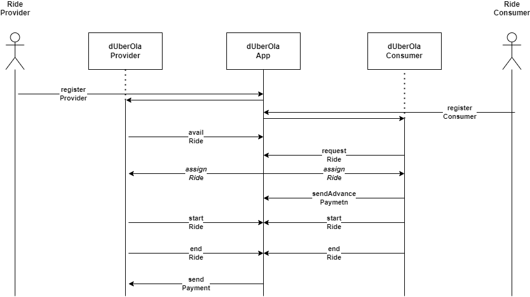

# Duberola
Decentralized Ride Share application

## Introduction

This project was done to fulfil the completion requirement of the course conducted by  on **Blockchains: Fundamentals and Applications**. The smart contracts are written in Solidity.

WARNING: Work-in-Progress

## Design

The current design is based on this default usecase as shown in the diagram below

## Acknowledgements

Thanks to , Department of Computer Science & Engg., IIT Madras and his team of TA(Divya, Bhargavi, PappuKumar, Bharath) for conducting an engaging, super-intensive, hands-on, twenty hours, month long course.  
